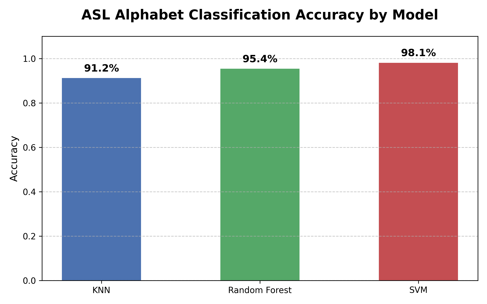

<div align="center">
  <h1>🤙 American Sign Language (ASL) Detection & Classification</h1>
  <p><strong>A Machine Learning pipeline for feature extraction and robust classification of ASL alphabet images.</strong></p>
  
  
  
  
  
</div>

<br />

## 📖 Overview
This repository contains a complete pipeline for recognizing and classifying the American Sign Language (ASL) alphabet. Originally built as an end-of-semester college project, it demonstrates the entire machine learning lifecycle—from data preprocessing and feature extraction to training, evaluation, and visualization.

By applying **Histogram of Oriented Gradients (HOG)** with traditional machine learning models (**SVM, KNN, Random Forest**), the project identifies distinct visual features in hand gestures to map them to specific alphabet letters.

## 📊 Dataset
The models are trained using the publicly available **Kaggle ASL Alphabet Dataset**. 
- The dataset features varying lighting conditions and angles.
- We balance the classes to prevent skewed predictions.
- **Classes:** 29 (A-Z, space, del, nothing)
- **Image dimensions:** 64x64 pixels (Resized for performance optimization)

## ⚙️ Methodology

Instead of using resource-heavy Deep Learning (CNNs), we leverage classical computer vision techniques:
1. **Data Preprocessing & Balancing:** The images are loaded, resized to `64x64`, and balanced to ensure equal representation for all signs.
2. **Feature Extraction (HOG):** The core mechanism is the *Histogram of Oriented Gradients*, which counts the occurrences of gradient orientation in localized portions of an image. This effectively highlights the edges and contours of hand shapes.
3. **Classification Models Evaluated:**
   - **Support Vector Machine (SVM):** Utilizing a linear kernel to find the optimal hyperplane between high-dimensional features.
   - **K-Nearest Neighbors (KNN):** Predicting classes based on proximity in feature space.
   - **Random Forest (RF):** An ensemble learning method reducing variance and overfitting.

## 📈 Results Highlights
Our evaluation revealed competitive accuracies across the models, showcasing that structural edge-based features (HOG) capture the essence of ASL hand signs very effectively:

- **Support Vector Machine:** High dimensional boundary identification yielded excellent results.
- **Random Forest:** Solid robustness against noise in the images.

<div align="center">
  
</div>

---

## 💻 Tech Stack
- **Languages:** Python
- **Vision & Image Processing:** OpenCV (`cv2`), `scikit-image`
- **Machine Learning:** `scikit-learn`
- **Data & Visualization:** `numpy`, `pandas`, `matplotlib`, `seaborn`

---

## 🚀 Getting Started

### 1. Clone the repository
```bash
git clone https://github.com/RohanBabbar/ASL-Detection-and-Classification.git
cd ASL-Detection-and-Classification
```

### 2. Set up the Environment
It is highly recommended to use a virtual environment:
```bash
python -m venv venv
source venv/bin/activate  # On Windows use: venv\Scripts\activate
pip install -r requirements.txt
```

### 3. Usage & Execution
We've modularized the code into production-ready scripts.
*Ensure that you have downloaded the Kaggle ASL dataset and placed it in an accessible directory (e.g., `data/asl_dataset`).*

- **Run the pipeline**: You can explore the newly refactored scripts located in the `src/` directory to run feature extraction and execute training models natively.

---

## 📂 Repository Structure

```text
├── README.md               <- Project documentation
├── requirements.txt        <- Python dependencies
├── assets/                 <- Auto-generated graphs and charts
├── src/                    <- Refactored modular python scripts
│   ├── dataset.py
│   ├── features.py
│   └── train.py
```
